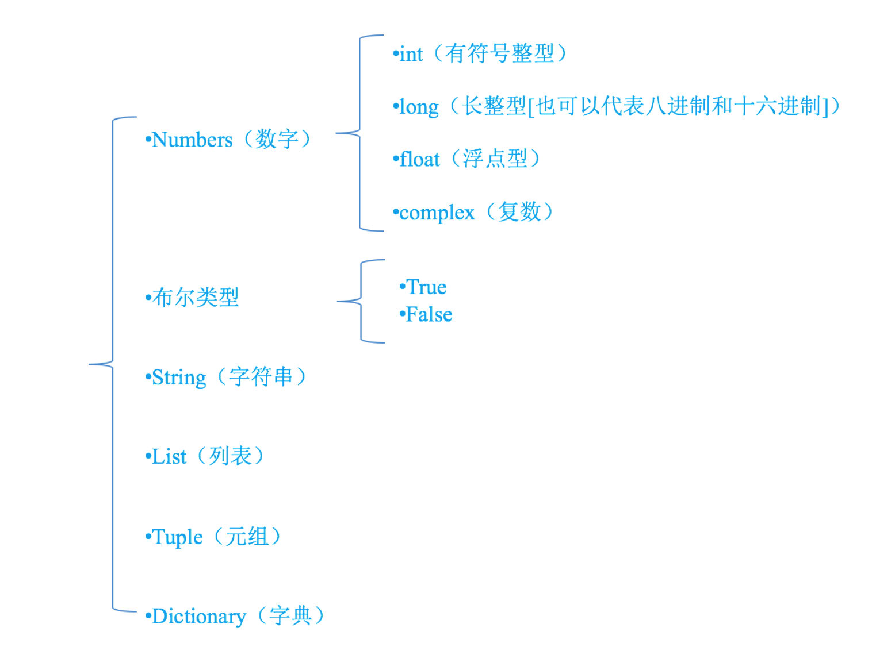

# 1.1 编写第一个python程序

```
print("hello word")
```

# 1.2 注释

- 注释的作用

通过用自己熟悉的语言，在程序中对某些代码进行标注说明，这就是注释的作用，能够大大增强程序的可读性

- 注释的分类

 - 1.单行注释
```
# 我是注释，可以在里写一些功能说明之类的哦
print('hello world')
```

 - 2.多行注释
```
    '''我是多行注释，可以写很多很多行的功能说明
        这就是我牛X指出

        哈哈哈。。。
    '''

    ''' 
        下面的代码完成 ，打印一首诗
        名字叫做：春江花月夜
        作者，忘了
    '''

    print('╔═╤═╤═╤═╤═╤═╤═╤═╤═╤═╤═╤═╤═╤═╤═╤═╤═╤═╤═╤═╗')
    print('║　│　│　│　│　│　│　│　│　│　│　│　│　│　│　│　│　│　│　│  ║')
    print('║　│　│　│　│　│　│　│　│　│　│　│　│　│　│　│　│　│　│　│　║')
    print('║　│春│滟│江│空│江│江│人│不│白│谁│可│玉│此│鸿│昨│江│斜│不│　║')
    print('║　│江│滟│流│里│天│畔│生│知│云│家│怜│户│时│雁│夜│水│月│知│　║')
    print('║　│潮│随│宛│流│一│何│代│江│一│今│楼│帘│相│长│闲│流│沉│乘│　║')
    print('║　│水│波│转│霜│色│人│代│月│片│夜│上│中│望│飞│潭│春│沉│月│　║')
    print('║　│连│千│绕│不│无│初│无│待│去│扁│月│卷│不│光│梦│去│藏│几│　║')
    print('║春│海│万│芳│觉│纤│见│穷│何│悠│舟│徘│不│相│不│落│欲│海│人│　║')
    print('║江│平│里│甸│飞│尘│月│已│人│悠│子│徊│去│闻│度│花│尽│雾│归│　║')
    print('║花│，│，│，│，│，│，│，│，│，│，│，│，│，│，│，│，│，│，│　║')
    print('║月│海│何│月│汀│皎│江│江│但│青│何│应│捣│愿│鱼│可│江│碣│落│　║')
    print('║夜│上│处│照│上│皎│月│月│见│枫│处│照│衣│逐│龙│怜│潭│石│月│　║')
    print('║　│明│春│花│白│空│何│年│长│浦│相│离│砧│月│潜│春│落│潇│摇│　║')
    print('║　│月│江│林│沙│中│年│年│江│上│思│人│上│华│跃│半│月│湘│情│　║')
    print('║　│共│无│皆│看│孤│初│望│送│不│明│妆│拂│流│水│不│复│无│满│　║')
    print('║　│潮│月│似│不│月│照│相│流│胜│月│镜│还│照│成│还│西│限│江│　║')
    print('║　│生│明│霰│见│轮│人│似│水│愁│楼│台│来│君│文│家│斜│路│树│　║')
    print('║　│。│。│。│。│。│？│。│。│。│？│。│。│。│。│。│。│。│。│　║')
    print('║　│　│　│　│　│　│　│　│　│　│　│　│　│　│　│　│　│　│　│　║')
    print('║　│　│　│　│　│　│　│　│　│　│　│　│　│　│　│　│　│　│　│　║')
    print('╚═╧═╧═╧═╧═╧═╧═╧═╧═╧═╧═╧═╧═╧═╧═╧═╧═╧═╧═╧═╝')
```

 - 3.python程序中，中文支持

    如果直接在程序中用到了中文，比如

```
print('你好')
```

如果直接运行输出，程序会出错：
    
解决的办法为：在程序的开头写入如下代码，这就是中文注释
    
    
```
#coding=utf-8
```

### 注意：

在python的语法规范中推荐使用的方式：

```
# -*- coding:utf-8 -*-
```

# 1.3 变量以及类型

- 1.变量的定义

在Python中，存储一个数据，需要一个叫做变量的东西，如下示例:

```
num1 = 100 #num1就是一个变量，就好一个小菜篮子

num2 = 87  #num2也是一个变量

result = num1 + num2 #把num1和num2这两个"菜篮子"中的数据进行累加，然后放到 result变量中
```
说明:

    - 所谓变量，可以理解为菜篮子，如果需要存储多个数据，最简单的方式是有多个变量，当然了也可以使用一个
    - 程序就是用来处理数据的，而变量就是用来存储数据的

- 2.变量的类型

    - 程序中:为了更充分的利用内存空间以及更有效率的管理内存，变量是有不同的类型的，如下所示:<br>

    
    - 怎样知道一个变量的类型呢？

        - 在python中，只要定义了一个变量，而且它有数据，那么它的类型就已经确定了，不需要咱们开发者主动的去说明它的类型，系统会自动辨别
        
        - 可以使用type(变量的名字)，来查看变量的类型


# 1.4 标示符和关键字

- 1.标示符

开发人员在程序中自定义的一些符号和名称<br>
标示符是自己定义的,如变量名 、函数名等

- 2.标示符的规则

    - 标示符由字母、下划线和数字组成，且数字不能开头
    - python中的标识符是区分大小写的

- 3.命名规则

驼峰命名法

    - 小驼峰式命名法（lower camel case）： 第一个单词以小写字母开始；第二个单词的首字母大写，例如：myName、aDog
    - 大驼峰式命名法（upper camel case）： 每一个单字的首字母都采用大写字母，例如：FirstName、LastName
    - 不过在程序员中还有一种命名法比较流行，就是用下划线“_”来连接所有的单词，比如send_buf
    
- 4.关键字

    - 什么是关键字
    
    python一些具有特殊功能的标示符，这就是所谓的关键字<br>
    关键字，是python已经使用的了，所以不允许开发者自己定义和关键字相同的名字的标示符
    
    - 查看关键字:
    
    <table>
        <tr>
            <th>and</th>
            <th>as</th>
            <th>assert</th>
            <th>break</th>
            <th>class</th>
            <th>continue</th>
            <th>def</th>
            <th>del</th>
        </tr>
        <tr>
            <th>elif</th>
            <th>else</th>
            <th>except</th>
            <th>exec</th>
            <th>finally</th>
            <th>for</th>
            <th>from</th>
            <th>global</th>
        </tr>
        <tr>
            <th>if</th>
            <th>in</th>
            <th>import</th>
            <th>is</th>
            <th>lambda</th>
            <th>not</th>
            <th>or</th>
            <th>pass</th>
        </tr>
        <tr>
            <th>print</th>
            <th>raise</th>
            <th>return</th>
            <th>try</th>
            <th>while</th>
            <th>with</th>
            <th>yield</th>
        </tr>
    </table>


可以通过以下命令进行查看当前系统中python的关键字
```
import keyword
keyword.kwlist
```

# 1.5 输出

- 1.输出

    python中变量的输出
```
# 打印提示
print('hello world')
print('你好')
```

- 2.格式化输出

    什么是格式化

```
    age = 10
    print("我今年%d岁"%age)

    age += 1
    print("我今年%d岁"%age)

    age += 1
    print("我今年%d岁"%age)
```
在程序中，看到了%这样的操作符，这就是Python中格式化输出。

```
    age = 18
    name = "xiaohua"
    print("我的姓名是%s,年龄是%d"%(name,age))
```

- 3.常用的格式符号

格式符号 | 转换
---|---
%c | 字符
%s | 通过str() 字符串转换来格式化
%i | 有符号十进制整数
%d | 有符号十进制整数
%u | 无符号十进制整数
%o | 八进制整数
%x | 十六进制整数（小写字母）
%X | 十六进制整数（大写字母）
%e | 索引符号（小写'e'）
%E | 索引符号（大写“E”）
%f | 浮点实数
%g | ％f和％e 的简写
%G | ％f和％E的简写

- 4.换行输出

在输出的时候，如果有\n那么，此时\n后的内容会在另外一行显示

```
print("1234567890-------") # 会在一行显示

print("1234567890\n-------") # 一行显示1234567890，另外一行显示-------
```

# 1.6 输入

- 1.raw_input()
    
在Python中，获取键盘输入的数据的方法是采用 raw_input 
函数，那么这个 raw_input 怎么用呢? 
```
password = raw_input("请输入密码:")
print '您刚刚输入的密码是:', password
```
**注意:**
```
- raw_input()的小括号中放入的是，提示信息，用来在获取数据之前给用户的一个简单提示
- raw_input()在从键盘获取了数据以后，会存放到等号右边的变量中
- raw_input()会把用户输入的任何值都作为字符串来对待
```

- 2.input()

    input()函数与raw_input()类似，但其接受的输入必须是表达式。
    
```
>>> a = input() 
123
>>> a
123
>>> type(a)
<type 'int'>
>>> a = input()
abc
Traceback (most recent call last):
  File "<stdin>", line 1, in <module>
  File "<string>", line 1, in <module>
NameError: name 'abc' is not defined
>>> a = input()
"abc"
>>> a
'abc'
>>> type(a)
<type 'str'>
>>> a = input()
1+3
>>> a
4
>>> a = input()
"abc"+"def"
>>> a
'abcdef'
>>> value = 100
>>> a = input()
value
>>> a
100
```
input()接受表达式输入，并把表达式的结果赋值给等号左边的变量

- 3.python3版本中

        没有raw_input()函数，只有input()
        并且 python3中的input与python2中的raw_input()功能一样

# 1.7 运算符

- 1.算术运算符

下面以a=10 ,b=20为例进行计算

<table>
        <tr>
            <th>运算符</th>
            <th>描述</th>
            <th>实例</th>
        </tr>
        <tr>
            <th>+</th>
            <th>加</th>
            <th>两个对象相加 a + b 输出结果 30</th>
        </tr>
        <tr>
            <th>-</th>
            <th>减</th>
            <th>得到负数或是一个数减去另一个数 a - b 输出结果 -10</th>
        </tr>
        <tr>
            <th>*</th>
            <th>乘</th>
            <th>两个数相乘或是返回一个被重复若干次的字符串 a * b 输出结果 200</th>
        </tr>
        <tr>
            <th>/</th>
            <th>除</th>
            <th>x除以y b / a 输出结果 2</th>
        </tr>
        <tr>
            <th>//</th>
            <th>取整除</th>
            <th>返回商的整数部分 9//2 输出结果 4 , 9.0//2.0 输出结果 4.0</th>
        </tr>
        <tr>
            <th>%</th>
            <th>取余</th>
            <th>返回除法的余数 b % a 输出结果 0</th>
        </tr>
        <tr>
            <th>**</th>
            <th>幂</th>
            <th>返回x的y次幂 a**b 为10的20次方， 输出结果 100000000000000000000</th>
        </tr>
</table>

```
>>> 9/2.0
4.5
>>> 9//2.0
4.0
```
- 2.赋值运算符

运算符 | 描述 | 实例
---|--- |---
= | 赋值运算符 | 把=号右边的结果给左边的变量 num=1+2*3 结果num的值为7

```
>>> a, b = 1, 2
>>> a
1
>>> b
2
```

- 3.复合赋值运算符

运算符 | 描述 | 实例
---|---|---
+= | 加法赋值运算符 | c += a 等效于 c = c + a
-= | 减法赋值运算符 | c -= a 等效于 c = c - a
*= | 乘法赋值运算符 | c *= a 等效于 c = c * a
/= | 除法赋值运算符 | c /= a 等效于 c = c / a
%= | 取模赋值运算符 | c %= a 等效于 c = c % a
**= | 幂赋值运算符 | c **= a 等效于 c = c ** a
//= | 取整除赋值运算符 | c //= a 等效于 c = c // a

# 1.8 常用的数据类型转换

函数 | 说明
---|---
int(x [,base ]) | 将x转换为一个整数
long(x [,base ]) | 将x转换为一个长整数
float(x ) | 将x转换到一个浮点数
complex(real [,imag ]) | 创建一个复数
str(x ) | 将对象 x 转换为字符串
repr(x ) | 将对象 x 转换为表达式字符串
eval(str ) | 用来计算在字符串中的有效Python表达式,并返回一个对象
tuple(s ) | 将序列 s 转换为一个元组
list(s ) | 将序列 s 转换为一个列表
chr(x ) | 将一个整数转换为一个字符
unichr(x ) | 将一个整数转换为Unicode字符
ord(x ) | 将一个字符转换为它的整数值
hex(x ) | 将一个整数转换为一个十六进制字符串
oct(x ) | 将一个整数转换为一个八进制字符串

**举例**

```
a = '100' # 此时a的类型是一个字符串，里面存放了100这3个字符
b = int(a) # 此时b的类型是整型，里面存放的是数字100

print("a=%d"%b)
```


# 1.9 标示符和关键字
# 1.10 标示符和关键字
# 1.11 标示符和关键字