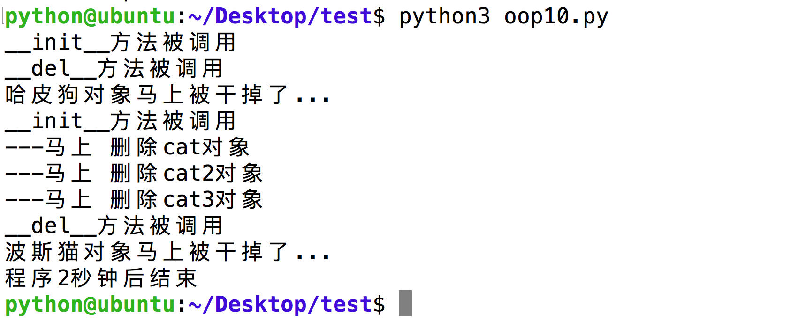
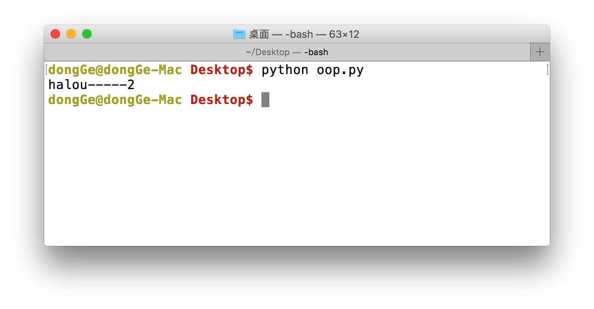
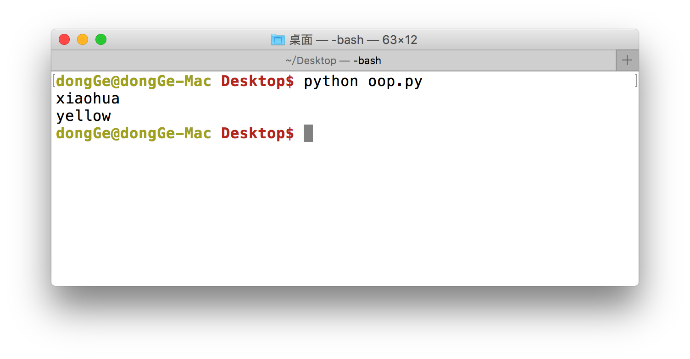
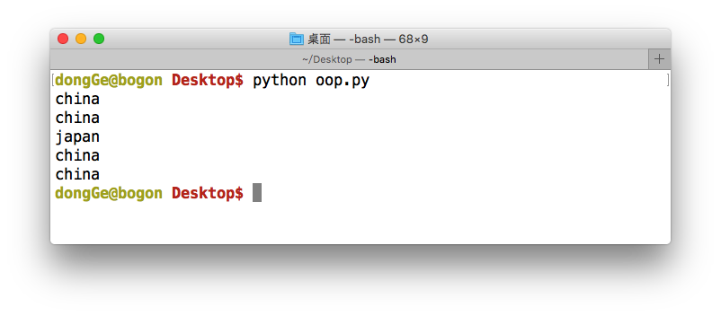

# 7.面向对象2

## 7.1.应用
1. 人
    - 属
        - 姓名
        - 血量
        - 持有的枪
    - 方法
        - 安子弹
        - 安弹夹
        - 拿枪（持有抢）
        - 开枪
2. 子弹类
    - 属性
        - 杀伤力
    - 方法
        - 伤害敌人(让敌人掉血)
3. 弹夹类
    - 属性
        - 容量（子弹存储的最大值）
        - 当前保存的子弹
    - 方法
        - 保存子弹（安装子弹的时候）
        - 弹出子弹（开枪的时候）
4. 枪类
    - 属性
        - 弹夹（默认没有弹夹，需要安装）
    - 方法
        - 连接弹夹（保存弹夹）
        - 射子弹

参考代码

```
#人类
class Ren:
    def __init__(self,name):
        self.name = name
        self.xue = 100
        self.qiang = None

    def __str__(self):
        return self.name + "剩余血量为:" + str(self.xue)

    def anzidan(self,danjia,zidan):
        danjia.baocunzidan(zidan)

    def andanjia(self,qiang,danjia):
        qiang.lianjiedanjia(danjia)

    def naqiang(self,qiang):
        self.qiang = qiang

    def kaiqiang(self,diren):
        self.qiang.she(diren)

    def diaoxue(self,shashangli):
        self.xue -= shashangli

#弹夹类
class Danjia:
    def __init__(self, rongliang):
        self.rongliang = rongliang
        self.rongnaList = []

    def __str__(self):
        return "弹夹当前的子弹数量为:" + str(len(self.rongnaList)) + "/" + str(self.rongliang)

    def baocunzidan(self,zidan):
        if len(self.rongnaList) < self.rongliang:
            self.rongnaList.append(zidan)

    def chuzidan(self):
        #判断当前弹夹中是否还有子弹
        if len(self.rongnaList) > 0:
            #获取最后压入到单间中的子弹
            zidan = self.rongnaList[-1]
            self.rongnaList.pop()
            return zidan
        else:
            return None

#子弹类
class Zidan:
    def __init__(self,shashangli):
        self.shashangli = shashangli

    def shanghai(self,diren):
        diren.diaoxue(self.shashangli)

#枪类
class Qiang:
    def __init__(self):
        self.danjia = None

    def __str__(self):
        if self.danjia:
            return "枪当前有弹夹"
        else:
            return "枪没有弹夹"

    def lianjiedanjia(self,danjia):
        if not self.danjia:
            self.danjia = danjia


    def she(self,diren):
        zidan = self.danjia.chuzidan()
        if zidan:
            zidan.shanghai(diren)
        else:
            print("没有子弹了，放了空枪....")


#创建一个人对象
laowang = Ren("老王")

#创建一个弹夹
danjia = Danjia(20)
print(danjia)

#循环的方式创建一颗子弹，然后让老王把这颗子弹压入到弹夹中
i=0
while i<5:
    zidan = Zidan(5)
    laowang.anzidan(danjia,zidan)
    i+=1
#测试一下，安装完子弹后，弹夹中的信息
print(danjia)

#创建一个枪对象
qiang = Qiang()
print(qiang)
#让老王，把弹夹连接到枪中
laowang.andanjia(qiang,danjia)
print(qiang)


#创建一个敌人
diren = Ren("敌人")
print(diren)

#让老王拿起枪
laowang.naqiang(qiang)

#老王开枪射敌人
laowang.kaiqiang(diren)
print(diren)
print(danjia)

laowang.kaiqiang(diren)
print(diren)
print(danjia)
```

## 7.2.保护对象的属性

如果有一个对象，当需要对其进行修改属性时，有2种方法

- 对象名.属性名 = 数据 ---->直接修改
- 对象名.方法名() ---->间接修改

为了更好的保存属性安全，即不能随意修改，一般的处理方式为

- 将属性定义为私有属性
- 添加一个可以调用的方法，供调用

```
class People(object):

    def __init__(self, name):
        self.__name = name

    def getName(self):
        return self.__name

    def setName(self, newName):
        if len(newName) >= 5:
            self.__name = newName
        else:
            print("error:名字长度需要大于或者等于5")

xiaoming = People("dongGe")
print(xiaoming.__name)
```


```
class People(object):

    def __init__(self, name):
        self.__name = name

    def getName(self):
        return self.__name

    def setName(self, newName):
        if len(newName) >= 5:
            self.__name = newName
        else:
            print("error:名字长度需要大于或者等于5")

xiaoming = People("dongGe")

xiaoming.setName("wanger")
print(xiaoming.getName())

xiaoming.setName("lisi")
print(xiaoming.getName())
```


**总结**

- Python中没有像C++中public和private这些关键字来区别公有属性和私有属性
- 它是以属性命名方式来区分，如果在属性名前面加了2个下划线'__'，则表明该属性是私有属性，否则为公有属性（方法也是一样，方法名前面加了2个下划线的话表示该方法是私有的，否则为公有的）。

## 7.3.__del__方法
创建对象后，python解释器默认调用__init__()方法；

当删除一个对象时，python解释器也会默认调用一个方法，这个方法为__del__()方法

```
import time
class Animal(object):

    # 初始化方法
    # 创建完对象后会自动被调用
    def __init__(self, name):
        print('__init__方法被调用')
        self.__name = name


    # 析构方法
    # 当对象被删除时，会自动被调用
    def __del__(self):
        print("__del__方法被调用")
        print("%s对象马上被干掉了..."%self.__name)

# 创建对象
dog = Animal("哈皮狗")

# 删除对象
del dog


cat = Animal("波斯猫")
cat2 = cat
cat3 = cat

print("---马上 删除cat对象")
del cat
print("---马上 删除cat2对象")
del cat2
print("---马上 删除cat3对象")
del cat3

print("程序2秒钟后结束")
time.sleep(2)
```


**总结**

- 当有1个变量保存了对象的引用时，此对象的引用计数就会加1
- 当使用del删除变量指向的对象时，如果对象的引用计数不会1，比如3，那么此时只会让这个引用计数减1，即变为2，当再次调用del时，变为1，如果再调用1次del，此时会真的把对象进行删除

## 7.4.单继承
1.继承示例

```
# 定义一个父类，如下:
class Cat(object):

    def __init__(self, name, color="白色"):
        self.name = name
        self.color = color

    def run(self):
        print("%s--在跑"%self.name)


# 定义一个子类，继承Cat类如下:
class Bosi(Cat):

    def setNewName(self, newName):
        self.name = newName

    def eat(self):
        print("%s--在吃"%self.name)


bs = Bosi("印度猫")
print('bs的名字为:%s'%bs.name)
print('bs的颜色为:%s'%bs.color)
bs.eat()
bs.setNewName('波斯')
bs.run()
```
运行结果:


**说明：**
- 虽然子类没有定义__init__方法，但是父类有，所以在子类继承父类的时候这个方法就被继承了，所以只要创建Bosi的对象，就默认执行了那个继承过来的__init__方法

**总结**

- 子类在继承的时候，在定义类时，小括号()中为父类的名字
- 父类的属性、方法，会被继承给子类

2.注意点

```
class Animal(object):

    def __init__(self, name='动物', color='白色'):
        self.__name = name
        self.color = color

    def __test(self):
        print(self.__name)
        print(self.color)

    def test(self):
        print(self.__name)
        print(self.color)


class Dog(Animal):
    def dogTest1(self):
        #print(self.__name) #不能访问到父类的私有属性
        print(self.color)


    def dogTest2(self):
        #self.__test() #不能访问父类中的私有方法
        self.test()


A = Animal()
#print(A.__name) #程序出现异常，不能访问私有属性
print(A.color)
#A.__test() #程序出现异常，不能访问私有方法
A.test()

print("------分割线-----")

D = Dog(name = "小花狗", color = "黄色")
D.dogTest1()
D.dogTest2()
```

- 私有的属性，不能通过对象直接访问，但是可以通过方法访问
- 私有的方法，不能通过对象直接访问
- 私有的属性、方法，不会被子类继承，也不能被访问
- 一般情况下，私有的属性、方法都是不对外公布的，往往用来做内部的事情，起到安全的作用

## 7.5.多继承
Python中多继承的格式如下:

```
# 定义一个父类
class A:
    def printA(self):
        print('----A----')

# 定义一个父类
class B:
    def printB(self):
        print('----B----')

# 定义一个子类，继承自A、B
class C(A,B):
    def printC(self):
        print('----C----')

obj_C = C()
obj_C.printA()
obj_C.printB()

```
运行结果:

```
----A----
----B----
```
说明

- python中是可以多继承的
- 父类中的方法、属性，子类会继承

注意点

想一想:

> 如果在上面的多继承例子中，如果父类A和父类B中，有一个同名的方法，那么通过子类去调用的时候，调用哪个？

```
#coding=utf-8
class base(object):
    def test(self):
        print('----base test----')
class A(base):
    def test(self):
        print('----A test----')

# 定义一个父类
class B(base):
    def test(self):
        print('----B test----')

# 定义一个子类，继承自A、B
class C(A,B):
    pass


obj_C = C()
obj_C.test()

print(C.__mro__) #可以查看C类的对象搜索方法时的先后顺序

```

## 7.6.重写父类方法与调用父类方法
1.重写父类方法

所谓重写，就是子类中，有一个和父类相同名字的方法，在子类中的方法会覆盖掉父类中同名的方法

```
#coding=utf-8
class Cat(object):
    def sayHello(self):
        print("halou-----1")


class Bosi(Cat):

    def sayHello(self):
        print("halou-----2")

bosi = Bosi()

bosi.sayHello()
```



2.调用父类的方法
 
```
#coding=utf-8
class Cat(object):
    def __init__(self,name):
        self.name = name
        self.color = 'yellow'


class Bosi(Cat):

    def __init__(self,name):
        # 调用父类的__init__方法1(python2)
        #Cat.__init__(self,name)
        # 调用父类的__init__方法2
        #super(Bosi,self).__init__(name)
        # 调用父类的__init__方法3
        super().__init__(name)

    def getName(self):
        return self.name

bosi = Bosi('xiaohua')

print(bosi.name)
print(bosi.color)
```


## 7.7.多态
多态的概念是应用于Java和C#这一类强类型语言中，而Python崇尚“鸭子类型”。

所谓多态：定义时的类型和运行时的类型不一样，此时就成为多态

- Python伪代码实现Java或C#的多态

```
class F1(object):
    def show(self):
        print 'F1.show'

class S1(F1):
    def show(self):
        print 'S1.show'

class S2(F1):
    def show(self):
        print 'S2.show'

# 由于在Java或C#中定义函数参数时，必须指定参数的类型
# 为了让Func函数既可以执行S1对象的show方法，又可以执行S2对象的show方法，所以，定义了一个S1和S2类的父类
# 而实际传入的参数是：S1对象和S2对象

def Func(F1 obj):
    """Func函数需要接收一个F1类型或者F1子类的类型"""

    print obj.show()

s1_obj = S1()
Func(s1_obj) # 在Func函数中传入S1类的对象 s1_obj，执行 S1 的show方法，结果：S1.show

s2_obj = S2()
Func(s2_obj) # 在Func函数中传入Ss类的对象 ss_obj，执行 Ss 的show方法，结果：S2.show
```

- Python “鸭子类型”

```
class F1(object):
    def show(self):
        print 'F1.show'

class S1(F1):

    def show(self):
        print 'S1.show'

class S2(F1):

    def show(self):
        print 'S2.show'

def Func(obj):
    print obj.show()

s1_obj = S1()
Func(s1_obj) 

s2_obj = S2()
Func(s2_obj)
```
## 7.8.类属性、实例属性
在了解了类基本的东西之后，下面看一下python中这几个概念的区别

先来谈一下类属性和实例属性

在前面的例子中我们接触到的就是实例属性（对象属性），顾名思义，类属性就是类对象所拥有的属性，它被所有类对象的实例对象所共有，在内存中只存在一个副本，这个和C++中类的静态成员变量有点类似。对于公有的类属性，在类外可以通过类对象和实例对象访问

类属性

```
class People(object):
    name = 'Tom'  #公有的类属性
    __age = 12     #私有的类属性

p = People()

print(p.name)           #正确
print(People.name)      #正确
print(p.__age)            #错误，不能在类外通过实例对象访问私有的类属性
print(People.__age)        #错误，不能在类外通过类对象访问私有的类属性
```

实例属性(对象属性)

```
class People(object):
    address = '山东' #类属性
    def __init__(self):
        self.name = 'xiaowang' #实例属性
        self.age = 20 #实例属性

p = People()
p.age =12 #实例属性
print(p.address) #正确
print(p.name)    #正确
print(p.age)     #正确

print(People.address) #正确
print(People.name)    #错误
print(People.age)     #错误

```

通过实例(对象)去修改类属性

```
class People(object):
    country = 'china' #类属性


print(People.country)
p = People()
print(p.country)
p.country = 'japan' 
print(p.country)      #实例属性会屏蔽掉同名的类属性
print(People.country)
del p.country    #删除实例属性
print(p.country)

```


总结

- 如果需要在类外修改类属性，必须通过类对象去引用然后进行修改。如果通过实例对象去引用，会产生一个同名的实例属性，这种方式修改的是实例属性，不会影响到类属性，并且之后如果通过实例对象去引用该名称的属性，实例属性会强制屏蔽掉类属性，即引用的是实例属性，除非删除了该实例属性。

## 7.9.静态方法和类方法