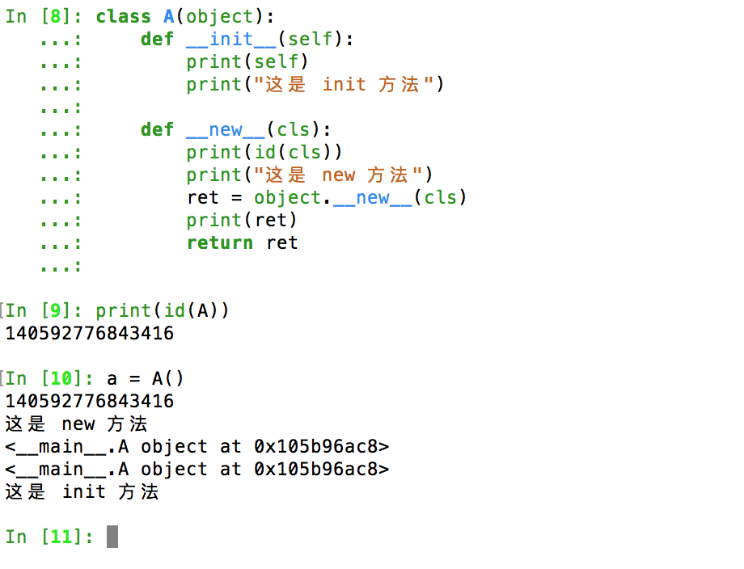
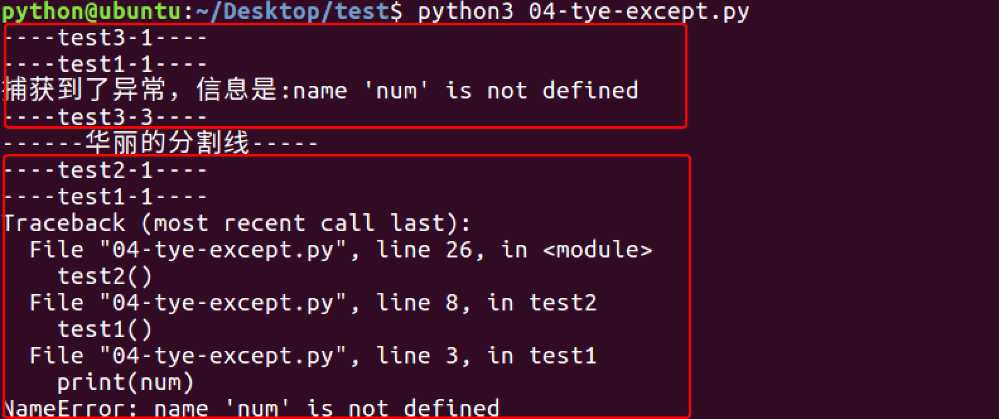
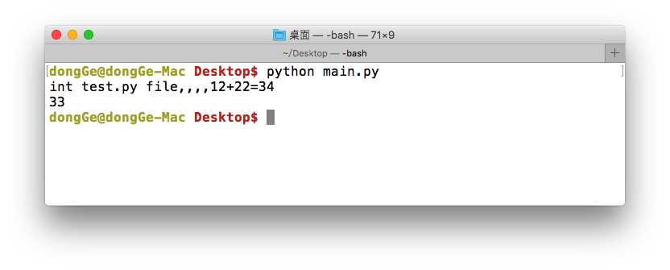
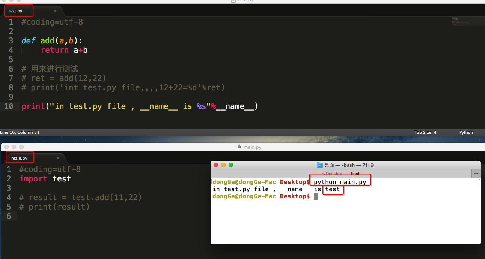
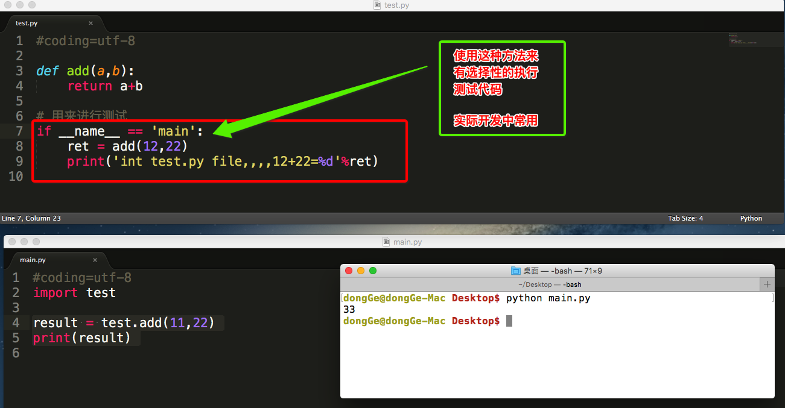

# 8.面向对象3、异常、模块

## 8.1.练习:设计类
1.设计一个卖车的4S店，该怎样做呢？

```
# 定义车类
class Car(object):

    # 定义车的方法
    def move(self):
        print("---车在移动---")

    def stop(self):
        print("---停车---")

# 定义一个销售车的店类
class CarStore(object):

    def order(self):
        self.car = Car() #找一辆车
        self.car.move()
        self.car.stop()
```
说明

> 上面的4s店，只能销售那一种类型的车
> 
> 如果这个是个销售北京现代品牌的车，比如伊兰特、索纳塔等，该怎样做呢？

2.设计一个卖北京现代车的4S店

```
# 定义伊兰特车类
class YilanteCar(object):

    # 定义车的方法
    def move(self):
        print("---车在移动---")

    def stop(self):
        print("---停车---")

# 定义索纳塔车类
class SuonataCar(object):

    # 定义车的方法
    def move(self):
        print("---车在移动---")

    def stop(self):
        print("---停车---")

# 定义一个销售北京现代车的店类
class CarStore(object):

    def order(self, typeName):
        #根据客户的不同要求，生成不同的类型的车
        if typeName == "伊兰特":
            car = YilanteCar()
        elif typeName == "索纳塔":
            car = SuonataCar()
        return car
```

## 8.2.工厂模式
- 1.简单工厂模式
    - 1.使用函数实现
        ```
            # 定义伊兰特车类
            class YilanteCar(object):

            # 定义车的方法
            def move(self):
                print("---车在移动---")

            def stop(self):
                print("---停车---")

            # 定义索纳塔车类
            class SuonataCar(object):

             # 定义车的方法
            def move(self):
                print("---车在移动---")

            def stop(self):
                 print("---停车---")

            # 用来生成具体的对象
                def createCar(typeName):
                    if typeName == "伊兰特":
                         car = YilanteCar()
                    elif typeName == "索纳塔":
                        car = SuonataCar()
                        return car

            # 定义一个销售北京现代车的店类
                class CarStore(object):

            def order(self, typeName):
            # 让工厂根据类型，生产一辆汽车
                car = createCar(typeName)
                return car
        ```
    - 2.使用类来实现
    
```
# 定义伊兰特车类
class YilanteCar(object):

    # 定义车的方法
    def move(self):
        print("---车在移动---")

    def stop(self):
        print("---停车---")

# 定义索纳塔车类
class SuonataCar(object):

    # 定义车的方法
    def move(self):
        print("---车在移动---")

    def stop(self):
        print("---停车---")

# 定义一个生产汽车的工厂，让其根据具体的订单生产车
class CarFactory(object):

    def createCar(self,typeName):
        if typeName == "伊兰特":
            car = YilanteCar()
        elif typeName == "索纳塔":
            car = SuonataCar()

        return car

# 定义一个销售北京现代车的店类
class CarStore(object):

    def __init__(self):
        #设置4s店的指定生产汽车的工厂
        self.carFactory = CarFactory()

    def order(self, typeName):
        # 让工厂根据类型，生产一辆汽车
        car = self.carFactory.createCar(typeName)
        return car
```

> 咋一看来，好像只是把生产环节重新创建了一个类，这确实比较像是一种编程习惯，此种解决方式被称作简单工厂模式
> 
> 工厂函数、工厂类对具体的生成环节进行了封装，这样有利于代码的后需扩展，即把功能划分的更具体，4s店只负责销售，汽车厂只负责制造

2.工厂方法模式

多种品牌的汽车4S店

当买车时，有很多种品牌可以选择，比如北京现代、别克、凯迪拉克、特斯拉等，那么此时该怎样进行设计呢？

```
# 定义一个基本的4S店类
class CarStore(object):

    #仅仅是定义了有这个方法，并没有实现，具体功能，这个需要在子类中实现
    def createCar(self, typeName):
        pass

    def order(self, typeName):
        # 让工厂根据类型，生产一辆汽车
        self.car = self.createCar(typeName)
        self.car.move()
        self.car.stop()

# 定义一个北京现代4S店类
class XiandaiCarStore(CarStore):

    def createCar(self, typeName):
        self.carFactory = CarFactory()
        return self.carFactory.createCar(typeName)


# 定义伊兰特车类
class YilanteCar(object):

    # 定义车的方法
    def move(self):
        print("---车在移动---")

    def stop(self):
        print("---停车---")

# 定义索纳塔车类
class SuonataCar(object):

    # 定义车的方法
    def move(self):
        print("---车在移动---")

    def stop(self):
        print("---停车---")

# 定义一个生产汽车的工厂，让其根据具体得订单生产车
class CarFactory(object):

    def createCar(self,typeName):
        self.typeName = typeName
        if self.typeName == "伊兰特":
            self.car = YilanteCar()
        elif self.typeName == "索纳塔":
            self.car = SuonataCar()

        return self.car

suonata = XiandaiCarStore()
suonata.order("索纳塔")
```

最后来看看工厂方法模式的定义

> 定义了一个创建对象的接口(可以理解为函数)，但由子类决定要实例化的类是哪一个，工厂方法模式让类的实例化推迟到子类，抽象的CarStore提供了一个创建对象的方法createCar，也叫作工厂方法。
> 
> 子类真正实现这个createCar方法创建出具体产品。 创建者类不需要直到实际创建的产品是哪一个，选择了使用了哪个子类，自然也就决定了实际创建的产品是什么。
> 
    
## 8.3.__new__方法
__new__和__init__的作用

```
class A(object):
    def __init__(self):
        print("这是 init 方法")

    def __new__(cls):
        print("这是 new 方法")
        return object.__new__(cls)

A()
```
总结

- __new__至少要有一个参数cls，代表要实例化的类，此参数在实例化时由Python解释器自动提供

- __new__必须要有返回值，返回实例化出来的实例，这点在自己实现__new__时要特别注意，可以return父类__new__出来的实例，或者直接是object的__new__出来的实例

- __init__有一个参数self，就是这个__new__返回的实例，__init__在__new__的基础上可以完成一些其它初始化的动作，__init__不需要返回值

- 我们可以将类比作制造商，__new__方法就是前期的原材料购买环节，__init__方法就是在有原材料的基础上，加工，初始化商品环节

注意点



## 8.4.单利模式
1.单例是什么

举个常见的单例模式例子，我们日常使用的电脑上都有一个回收站，在整个操作系统中，回收站只能有一个实例，整个系统都使用这个唯一的实例，而且回收站自行提供自己的实例。因此回收站是单例模式的应用。

确保某一个类只有一个实例，而且自行实例化并向整个系统提供这个实例，这个类称为单例类，单例模式是一种对象创建型模式。

2.创建单例-保证只有1个对象

```
# 实例化一个单例
class Singleton(object):
    __instance = None

    def __new__(cls, age, name):
        #如果类数字能够__instance没有或者没有赋值
        #那么就创建一个对象，并且赋值为这个对象的引用，保证下次调用这个方法时
        #能够知道之前已经创建过对象了，这样就保证了只有1个对象
        if not cls.__instance:
            cls.__instance = object.__new__(cls)
        return cls.__instance

a = Singleton(18, "dongGe")
b = Singleton(8, "dongGe")

print(id(a))
print(id(b))

a.age = 19 #给a指向的对象添加一个属性
print(b.age)#获取b指向的对象的age属性
```
运行结果：

```
In [12]: class Singleton(object):
    ...:     __instance = None
    ...: 
    ...:     def __new__(cls, age, name):
    ...:         if not cls.__instance:
    ...:             cls.__instance = object.__new__(cls)
    ...:         return cls.__instance
    ...: 
    ...: a = Singleton(18, "dongGe")
    ...: b = Singleton(8, "dongGe")
    ...: 
    ...: print(id(a))
    ...: print(id(b))
    ...: 
    ...: a.age = 19
    ...: print(b.age)
    ...: 
4391023224
4391023224
19
```

3.创建单例时，只执行1次__init__方法

```
# 实例化一个单例
class Singleton(object):
    __instance = None
    __first_init = False

    def __new__(cls, age, name):
        if not cls.__instance:
            cls.__instance = object.__new__(cls)
        return cls.__instance

    def __init__(self, age, name):
        if not self.__first_init:
            self.age = age
            self.name = name
            Singleton.__first_init = True


a = Singleton(18, "dongGe")
b = Singleton(8, "dongGe")

print(id(a))
print(id(b))


print(a.age)
print(b.age)

a.age = 19
print(b.age)

```
运行结果:


## 8.5.异常介绍
看如下示例:

```
print '-----test--1---'
open('123.txt','r')
print '-----test--2---'
```
运行结果:


说明:

> 打开一个不存在的文件123.txt，当找不到123.txt 文件时，就会抛出给我们一个IOError类型的错误，No such file or directory：123.txt （没有123.txt这样的文件或目录）

异常:

> 当Python检测到一个错误时，解释器就无法继续执行了，反而出现了一些错误的提示，这就是所谓的"异常"

## 8.6.捕获异常
1.捕获异常 try...except...

看如下示例:

```
try:
    print('-----test--1---')
    open('123.txt','r')
    print('-----test--2---')
except IOError:
    pass
```

说明:

- 此程序看不到任何错误，因为用except 捕获到了IOError异常，并添加了处理的方法
- pass 表示实现了相应的实现，但什么也不做；如果把pass改为print语句，那么就会输出其他信息

小总结:

- 
- 把可能出现问题的代码，放在try中
- 把处理异常的代码，放在except中

2.except捕获多个异常

看如下示例:

```
try:
    print num
except IOError:
    print('产生错误了')
```

想一想:
> 上例程序，已经使用except来捕获异常了，为什么还会看到错误的信息提示？

答:

> except捕获的错误类型是IOError，而此时程序产生的异常为 NameError ，所以except没有生效

修改后的代码为:

```
try:
    print num
except NameError:
    print('产生错误了')
```

实际开发中，捕获多个异常的方式，如下：

```
#coding=utf-8
try:
    print('-----test--1---')
    open('123.txt','r') # 如果123.txt文件不存在，那么会产生 IOError 异常
    print('-----test--2---')
    print(num)# 如果num变量没有定义，那么会产生 NameError 异常

except (IOError,NameError): 
    #如果想通过一次except捕获到多个异常可以用一个元组的方式

    # errorMsg里会保存捕获到的错误信息
    print(errorMsg)
```


注意：

- 当捕获多个异常时，可以把要捕获的异常的名字，放到except 后，并使用元组的方式仅进行存储
 
3.获取异常的信息描述


4.捕获所有异常


5.else

咱们应该对else并不陌生，在if中，它的作用是当条件不满足时执行的实行；同样在try...except...中也是如此，即如果没有捕获到异常，那么就执行else中的事情

```
try:
    num = 100
    print num
except NameError as errorMsg:
    print('产生错误了:%s'%errorMsg)
else:
    print('没有捕获到异常，真高兴')
```
运行结果如下:


6.try...finally...

try...finally...语句用来表达这样的情况：

> 在程序中，如果一个段代码必须要执行，即无论异常是否产生都要执行，那么此时就需要使用finally。 比如文件关闭，释放锁，把数据库连接返还给连接池等

demo:
```
import time
try:
    f = open('test.txt')
    try:
        while True:
            content = f.readline()
            if len(content) == 0:
                break
            time.sleep(2)
            print(content)
    except:
        #如果在读取文件的过程中，产生了异常，那么就会捕获到
        #比如 按下了 ctrl+c
        pass
    finally:
        f.close()
        print('关闭文件')
except:
    print("没有这个文件")
```

说明:

> test.txt文件中每一行数据打印，但是我有意在每打印一行之前用time.sleep方法暂停2秒钟。这样做的原因是让程序运行得慢一些。在程序运行的时候，按Ctrl+c中断（取消）程序。
> 
> 我们可以观察到KeyboardInterrupt异常被触发，程序退出。但是在程序退出之前，finally从句仍然被执行，把文件关闭。

## 8.7.异常的传递
1.try嵌套中

```
import time
try:
    f = open('test.txt')
    try:
        while True:
            content = f.readline()
            if len(content) == 0:
                break
            time.sleep(2)
            print(content)
    finally:
        f.close()
        print('关闭文件')
except:
    print("没有这个文件")
```
运行结果:

```
In [26]: import time
    ...: try:
    ...:     f = open('test.txt')
    ...:     try:
    ...:         while True:
    ...:             content = f.readline()
    ...:             if len(content) == 0:
    ...:                 break
    ...:             time.sleep(2)
    ...:             print(content)
    ...:     finally:
    ...:         f.close()
    ...:         print('关闭文件')
    ...: except:
    ...:     print("没有这个文件")
    ...: finally:
    ...:     print("最后的finally")
    ...:     
xxxxxxx--->这是test.txt文件中读取到信息
^C关闭文件
没有这个文件
最后的finally
```

2.函数嵌套调用中

```
    def test1():
        print("----test1-1----")
        print(num)
        print("----test1-2----")


    def test2():
        print("----test2-1----")
        test1()
        print("----test2-2----")


    def test3():
        try:
            print("----test3-1----")
            test1()
            print("----test3-2----")
        except Exception as result:
            print("捕获到了异常，信息是:%s"%result)

        print("----test3-2----")


    test3()
    print("------华丽的分割线-----")
    test2()

```
运行结果:



总结：

- 如果try嵌套，那么如果里面的try没有捕获到这个异常，那么外面的try会接收到这个异常，然后进行处理，如果外边的try依然没有捕获到，那么再进行传递。。。
- 如果一个异常是在一个函数中产生的，例如函数A---->函数B---->函数C,而异常是在函数C中产生的，那么如果函数C中没有对这个异常进行处理，那么这个异常会传递到函数B中，如果函数B有异常处理那么就会按照函数B的处理方式进行执行；如果函数B也没有异常处理，那么这个异常会继续传递，以此类推。。。如果所有的函数都没有处理，那么此时就会进行异常的默认处理，即通常见到的那样
- 注意观察上图中，当调用test3函数时，在test1函数内部产生了异常，此异常被传递到test3函数中完成了异常处理，而当异常处理完后，并没有返回到函数test1中进行执行，而是在函数test3中继续执行

## 8.8.抛出自定义的异常
你可以用raise语句来引发一个异常。异常/错误对象必须有一个名字，且它们应是Error或Exception类的子类

下面是一个引发异常的例子:

```
class ShortInputException(Exception):
    '''自定义的异常类'''
    def __init__(self, length, atleast):
        #super().__init__()
        self.length = length
        self.atleast = atleast

def main():
    try:
        s = input('请输入 --> ')
        if len(s) < 3:
            # raise引发一个你定义的异常
            raise ShortInputException(len(s), 3)
    except ShortInputException as result:#x这个变量被绑定到了错误的实例
        print('ShortInputException: 输入的长度是 %d,长度至少应是 %d'% (result.length, result.atleast))
    else:
        print('没有异常发生.')

main()
```
运行结果如下:


注意

- 以上程序中，关于代码#super().__init__()的说明

>     这一行代码，可以调用也可以不调用，建议调用，因为__init__方法往往是用来对创建完的对象进行初始化工作，如果在子类中重写了父类的__init__方法，即意味着父类中的很多初始化工作没有做，这样就不保证程序的稳定了，所以在以后的开发中，如果重写了父类的__init__方法，最好是先调用父类的这个方法，然后再添加自己的功能

## 8.9.异常处理中抛出异常

```
class Test(object):
    def __init__(self, switch):
        self.switch = switch #开关
    def calc(self, a, b):
        try:
            return a/b
        except Exception as result:
            if self.switch:
                print("捕获开启，已经捕获到了异常，信息如下:")
                print(result)
            else:
                #重新抛出这个异常，此时就不会被这个异常处理给捕获到，从而触发默认的异常处理
                raise


a = Test(True)
a.calc(11,0)

print("----------------------华丽的分割线----------------")

a.switch = False
a.calc(11,0)
```
运行结果:


## 8.10.模块介绍
1.Python中的模块

有过C语言编程经验的朋友都知道在C语言中如果要引用sqrt函数，必须用语句#include <math.h>引入math.h这个头文件，否则是无法正常进行调用的。

那么在Python中，如果要引用一些其他的函数，该怎么处理呢？

在Python中有一个概念叫做模块（module），这个和C语言中的头文件以及Java中的包很类似，比如在Python中要调用sqrt函数，必须用import关键字引入math这个模块，下面就来了解一下Python中的模块。

说的通俗点：模块就好比是工具包，要想使用这个工具包中的工具(就好比函数)，就需要导入这个模块

2.import

在Python中用关键字import来引入某个模块，比如要引用模块math，就可以在文件最开始的地方用import math来引入。

形如:

```
import module1,mudule2...
```
当解释器遇到import语句，如果模块在当前的搜索路径就会被导入。

在调用math模块中的函数时，必须这样引用：

```
模块名.函数名
```

- 想一想:
>     为什么必须加上模块名调用呢？
- 答:
>     因为可能存在这样一种情况：在多个模块中含有相同名称的函数，此时如果只是通过函数名来调用，解释器无法知道到底要调用哪个函数。所以如果像上述这样引入模块的时候，调用函数必须加上模块名

```
    import math

    #这样会报错
    print sqrt(2)

    #这样才能正确输出结果
    print math.sqrt(2)
```

有时候我们只需要用到模块中的某个函数，只需要引入该函数即可，此时可以用下面方法实现：

```
from 模块名 import 函数名1,函数名2....
```
不仅可以引入函数，还可以引入一些全局变量、类等

注意:

- 通过这种方式引入的时候，调用函数时只能给出函数名，不能给出模块名，但是当两个模块中含有相同名称函数的时候，后面一次引入会覆盖前一次引入。也就是说假如模块A中有函数function( )，在模块B中也有函数function( )，如果引入A中的function在先、B中的function在后，那么当调用function函数的时候，是去执行模块B中的function函数。

- 如果想一次性引入math中所有的东西，还可以通过from math import *来实现

3.from…import

Python的from语句让你从模块中导入一个指定的部分到当前命名空间中

语法如下：

```
from modname import name1[, name2[, ... nameN]]
```

例如，要导入模块fib的fibonacci函数，使用如下语句：

```
from fib import fibonacci
```
**注意**

- 不会把整个fib模块导入到当前的命名空间中，它只会将fib里的fibonacci单个引入

4.from … import *

把一个模块的所有内容全都导入到当前的命名空间也是可行的，只需使用如下声明：

```
from modname import *
```
**注意**

- 这提供了一个简单的方法来导入一个模块中的所有项目。然而这种声明不该被过多地使用。

5.as

```
    In [1]: import time as tt

    In [2]: time.sleep(1)
    ---------------------------------------------------------------------------
    NameError                                 Traceback (most recent call last)
    <ipython-input-2-07a34f5b1e42> in <module>()
    ----> 1 time.sleep(1)

    NameError: name 'time' is not defined

    In [3]: 

    In [3]: 

    In [3]: tt.sleep(1)

    In [4]: 

    In [4]: 

    In [4]: from time import sleep as sp

    In [5]: sleep(1)
    ---------------------------------------------------------------------------
    NameError                                 Traceback (most recent call last)
    <ipython-input-5-82e5c2913b44> in <module>()
    ----> 1 sleep(1)

    NameError: name 'sleep' is not defined

    In [6]: 

    In [6]: 

    In [6]: sp(1)

    In [7]:

```

6.定位模块

当你导入一个模块，Python解析器对模块位置的搜索顺序是：


- 当前目录
- 如果不在当前目录，Python则搜索在shell变量PYTHONPATH下的每个目录。
- 如果都找不到，Python会察看默认路径。UNIX下，默认路径一般为/usr/local/lib/python/
- 模块搜索路径存储在system模块的sys.path变量中。变量里包含当前目录，PYTHONPATH和由安装过程决定的默认目录。

## 8.11.模块制作
1.定义自己的模块

在Python中，每个Python文件都可以作为一个模块，模块的名字就是文件的名字。

比如有这样一个文件test.py，在test.py中定义了函数add

test.py

```
def add(a,b):
    return a+b
```

2.调用自己定义的模块

那么在其他文件中就可以先import test，然后通过test.add(a,b)来调用了，当然也可以通过from test import add来引入

main.py

```
import test

    result = test.add(11,22)
    print(result)
```

3.测试模块

在实际开中，当一个开发人员编写完一个模块后，为了让模块能够在项目中达到想要的效果，这个开发人员会自行在py文件中添加一些测试信息，例如：

test.py

```
def add(a,b):
        return a+b

    # 用来进行测试
    ret = add(12,22)
    print('int test.py file,,,,12+22=%d'%ret)
```

如果此时，在其他py文件中引入了此文件的话，想想看，测试的那段代码是否也会执行呢！

main.py

```
import test

    result = test.add(11,22)
    print(result)
```

运行现象：



至此，可发现test.py中的测试代码，应该是单独执行test.py文件时才应该执行的，不应该是其他的文件中引用而执行

为了解决这个问题，python在执行一个文件时有个变量__name__

直接运行此文件


在其他文件中import此文件



**总结：**

- 可以根据__name__变量的结果能够判断出，是直接执行的python脚本还是被引入执行的，从而能够有选择性的执行测试代码



## 8.12.模块中的__all__
1.没有__all__


2.模块中有__all__


**总结**
- 如果一个文件中有__all__变量，那么也就意味着这个变量中的元素，不会被from xxx import *时导入

## 8.13.python中的包

1.引入包
- 1.1 有2个模块功能有些联系


- 1.2 所以将其放到同一个文件夹下


- 1.3 使用import 文件.模块 的方式导入


- 1.4 使用from 文件夹 import 模块 的方式导入


- 1.5 在msg文件夹下创建__init__.py文件


- 1.6 在__init__.py文件中写入


- 1.7 重新使用from 文件夹 import 模块 的方式导入


**总结：**

- 包将有联系的模块组织在一起，即放到同一个文件夹下，并且在这个文件夹创建一个名字为__init__.py 文件，那么这个文件夹就称之为包
- 有效避免模块名称冲突问题，让应用组织结构更加清晰

2.__init__.py文件有什么用

__init__.py 控制着包的导入行为

- 2.1 __init__.py为空

仅仅是把这个包导入，不会导入包中的模块

- 2.2 __all__

在__init__.py文件中，定义一个__all__变量，它控制着 from 包名 import *时导入的模块

- 2.3 (了解)可以在__init__.py文件中编写内容

可以在这个文件中编写语句，当导入时，这些语句就会被执行

__init__.py文件


3.扩展：嵌套的包

假定我们的包的例子有如下的目录结构：

```
Phone/
    __init__.py
    common_util.py
    Voicedta/
        __init__.py
        Pots.py
        Isdn.py
    Fax/
        __init__.py
        G3.py
    Mobile/
        __init__.py
        Analog.py
        igital.py
    Pager/
        __init__.py
        Numeric.py
```
Phone 是最顶层的包，Voicedta 等是它的子包。 我们可以这样导入子包：

```
import Phone.Mobile.Analog
Phone.Mobile.Analog.dial()
```
你也可使用 from-import 实现不同需求的导入

第一种方法是只导入顶层的子包，然后使用属性/点操作符向下引用子包树：

```
from Phone import Mobile
Mobile.Analog.dial('555-1212')
```
此外，我们可以还引用更多的子包：

```
from Phone.Mobile import Analog
Analog.dial('555-1212')

```
事实上，你可以一直沿子包的树状结构导入：

```
from Phone.Mobile.Analog import dial
dial('555-1212')
```
在我们上边的目录结构中，我们可以发现很多的 __init__.py 文件。这些是初始化模块，from-import 语句导入子包时需要用到它。 如果没有用到，他们可以是空文件。

包同样支持 from-import all 语句：

```
from package.module import *
```
然而，这样的语句会导入哪些文件取决于操作系统的文件系统。所以我们在__init__.py 中加入 __all__ 变量。该变量包含执行这样的语句时应该导入的模块的名字。它由一个模块名字符串列表组成.。

## 8.14.模块发布
## 9.15.模块安装、使用