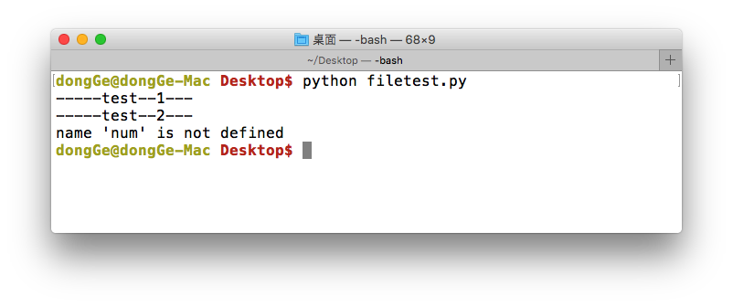

# 8.面向对象3、异常、模块

## 8.1.练习:设计类
1.设计一个卖车的4S店，该怎样做呢？

```
# 定义车类
class Car(object):

    # 定义车的方法
    def move(self):
        print("---车在移动---")

    def stop(self):
        print("---停车---")

# 定义一个销售车的店类
class CarStore(object):

    def order(self):
        self.car = Car() #找一辆车
        self.car.move()
        self.car.stop()
```
说明

> 上面的4s店，只能销售那一种类型的车
> 
> 如果这个是个销售北京现代品牌的车，比如伊兰特、索纳塔等，该怎样做呢？

2.设计一个卖北京现代车的4S店

```
# 定义伊兰特车类
class YilanteCar(object):

    # 定义车的方法
    def move(self):
        print("---车在移动---")

    def stop(self):
        print("---停车---")

# 定义索纳塔车类
class SuonataCar(object):

    # 定义车的方法
    def move(self):
        print("---车在移动---")

    def stop(self):
        print("---停车---")

# 定义一个销售北京现代车的店类
class CarStore(object):

    def order(self, typeName):
        #根据客户的不同要求，生成不同的类型的车
        if typeName == "伊兰特":
            car = YilanteCar()
        elif typeName == "索纳塔":
            car = SuonataCar()
        return car
```

## 8.2.工厂模式
- 1.简单工厂模式
    - 1.使用函数实现
        ```
            # 定义伊兰特车类
            class YilanteCar(object):

            # 定义车的方法
            def move(self):
                print("---车在移动---")

            def stop(self):
                print("---停车---")

            # 定义索纳塔车类
            class SuonataCar(object):

             # 定义车的方法
            def move(self):
                print("---车在移动---")

            def stop(self):
                 print("---停车---")

            # 用来生成具体的对象
                def createCar(typeName):
                    if typeName == "伊兰特":
                         car = YilanteCar()
                    elif typeName == "索纳塔":
                        car = SuonataCar()
                        return car

            # 定义一个销售北京现代车的店类
                class CarStore(object):

            def order(self, typeName):
            # 让工厂根据类型，生产一辆汽车
                car = createCar(typeName)
                return car
        ```
    - 2.使用类来实现
    
```
# 定义伊兰特车类
class YilanteCar(object):

    # 定义车的方法
    def move(self):
        print("---车在移动---")

    def stop(self):
        print("---停车---")

# 定义索纳塔车类
class SuonataCar(object):

    # 定义车的方法
    def move(self):
        print("---车在移动---")

    def stop(self):
        print("---停车---")

# 定义一个生产汽车的工厂，让其根据具体的订单生产车
class CarFactory(object):

    def createCar(self,typeName):
        if typeName == "伊兰特":
            car = YilanteCar()
        elif typeName == "索纳塔":
            car = SuonataCar()

        return car

# 定义一个销售北京现代车的店类
class CarStore(object):

    def __init__(self):
        #设置4s店的指定生产汽车的工厂
        self.carFactory = CarFactory()

    def order(self, typeName):
        # 让工厂根据类型，生产一辆汽车
        car = self.carFactory.createCar(typeName)
        return car
```

> 咋一看来，好像只是把生产环节重新创建了一个类，这确实比较像是一种编程习惯，此种解决方式被称作简单工厂模式
> 
> 工厂函数、工厂类对具体的生成环节进行了封装，这样有利于代码的后需扩展，即把功能划分的更具体，4s店只负责销售，汽车厂只负责制造

2.工厂方法模式

多种品牌的汽车4S店

当买车时，有很多种品牌可以选择，比如北京现代、别克、凯迪拉克、特斯拉等，那么此时该怎样进行设计呢？

```
# 定义一个基本的4S店类
class CarStore(object):

    #仅仅是定义了有这个方法，并没有实现，具体功能，这个需要在子类中实现
    def createCar(self, typeName):
        pass

    def order(self, typeName):
        # 让工厂根据类型，生产一辆汽车
        self.car = self.createCar(typeName)
        self.car.move()
        self.car.stop()

# 定义一个北京现代4S店类
class XiandaiCarStore(CarStore):

    def createCar(self, typeName):
        self.carFactory = CarFactory()
        return self.carFactory.createCar(typeName)


# 定义伊兰特车类
class YilanteCar(object):

    # 定义车的方法
    def move(self):
        print("---车在移动---")

    def stop(self):
        print("---停车---")

# 定义索纳塔车类
class SuonataCar(object):

    # 定义车的方法
    def move(self):
        print("---车在移动---")

    def stop(self):
        print("---停车---")

# 定义一个生产汽车的工厂，让其根据具体得订单生产车
class CarFactory(object):

    def createCar(self,typeName):
        self.typeName = typeName
        if self.typeName == "伊兰特":
            self.car = YilanteCar()
        elif self.typeName == "索纳塔":
            self.car = SuonataCar()

        return self.car

suonata = XiandaiCarStore()
suonata.order("索纳塔")
```

最后来看看工厂方法模式的定义

> 定义了一个创建对象的接口(可以理解为函数)，但由子类决定要实例化的类是哪一个，工厂方法模式让类的实例化推迟到子类，抽象的CarStore提供了一个创建对象的方法createCar，也叫作工厂方法。
> 
> 子类真正实现这个createCar方法创建出具体产品。 创建者类不需要直到实际创建的产品是哪一个，选择了使用了哪个子类，自然也就决定了实际创建的产品是什么。
> 
    
## 8.3.__new__方法
__new__和__init__的作用

```
class A(object):
    def __init__(self):
        print("这是 init 方法")

    def __new__(cls):
        print("这是 new 方法")
        return object.__new__(cls)

A()
```
总结

- __new__至少要有一个参数cls，代表要实例化的类，此参数在实例化时由Python解释器自动提供

- __new__必须要有返回值，返回实例化出来的实例，这点在自己实现__new__时要特别注意，可以return父类__new__出来的实例，或者直接是object的__new__出来的实例

- __init__有一个参数self，就是这个__new__返回的实例，__init__在__new__的基础上可以完成一些其它初始化的动作，__init__不需要返回值

- 我们可以将类比作制造商，__new__方法就是前期的原材料购买环节，__init__方法就是在有原材料的基础上，加工，初始化商品环节

注意点


## 8.4.单利模式
1.单例是什么

举个常见的单例模式例子，我们日常使用的电脑上都有一个回收站，在整个操作系统中，回收站只能有一个实例，整个系统都使用这个唯一的实例，而且回收站自行提供自己的实例。因此回收站是单例模式的应用。

确保某一个类只有一个实例，而且自行实例化并向整个系统提供这个实例，这个类称为单例类，单例模式是一种对象创建型模式。

2.创建单例-保证只有1个对象

```
# 实例化一个单例
class Singleton(object):
    __instance = None

    def __new__(cls, age, name):
        #如果类数字能够__instance没有或者没有赋值
        #那么就创建一个对象，并且赋值为这个对象的引用，保证下次调用这个方法时
        #能够知道之前已经创建过对象了，这样就保证了只有1个对象
        if not cls.__instance:
            cls.__instance = object.__new__(cls)
        return cls.__instance

a = Singleton(18, "dongGe")
b = Singleton(8, "dongGe")

print(id(a))
print(id(b))

a.age = 19 #给a指向的对象添加一个属性
print(b.age)#获取b指向的对象的age属性
```
运行结果：

```
In [12]: class Singleton(object):
    ...:     __instance = None
    ...: 
    ...:     def __new__(cls, age, name):
    ...:         if not cls.__instance:
    ...:             cls.__instance = object.__new__(cls)
    ...:         return cls.__instance
    ...: 
    ...: a = Singleton(18, "dongGe")
    ...: b = Singleton(8, "dongGe")
    ...: 
    ...: print(id(a))
    ...: print(id(b))
    ...: 
    ...: a.age = 19
    ...: print(b.age)
    ...: 
4391023224
4391023224
19
```

3.创建单例时，只执行1次__init__方法

```
# 实例化一个单例
class Singleton(object):
    __instance = None
    __first_init = False

    def __new__(cls, age, name):
        if not cls.__instance:
            cls.__instance = object.__new__(cls)
        return cls.__instance

    def __init__(self, age, name):
        if not self.__first_init:
            self.age = age
            self.name = name
            Singleton.__first_init = True


a = Singleton(18, "dongGe")
b = Singleton(8, "dongGe")

print(id(a))
print(id(b))


print(a.age)
print(b.age)

a.age = 19
print(b.age)

```
运行结果:


## 8.5.异常介绍
看如下示例:

```
print '-----test--1---'
open('123.txt','r')
print '-----test--2---'
```
运行结果:


说明:

> 打开一个不存在的文件123.txt，当找不到123.txt 文件时，就会抛出给我们一个IOError类型的错误，No such file or directory：123.txt （没有123.txt这样的文件或目录）

异常:

> 当Python检测到一个错误时，解释器就无法继续执行了，反而出现了一些错误的提示，这就是所谓的"异常"

## 8.6.捕获异常
1.捕获异常 try...except...

看如下示例:

```
try:
    print('-----test--1---')
    open('123.txt','r')
    print('-----test--2---')
except IOError:
    pass
```

说明:

- 此程序看不到任何错误，因为用except 捕获到了IOError异常，并添加了处理的方法
- pass 表示实现了相应的实现，但什么也不做；如果把pass改为print语句，那么就会输出其他信息

小总结:

- 
- 把可能出现问题的代码，放在try中
- 把处理异常的代码，放在except中

2.except捕获多个异常

看如下示例:

```
try:
    print num
except IOError:
    print('产生错误了')
```

想一想:
> 上例程序，已经使用except来捕获异常了，为什么还会看到错误的信息提示？

答:

> except捕获的错误类型是IOError，而此时程序产生的异常为 NameError ，所以except没有生效

修改后的代码为:

```
try:
    print num
except NameError:
    print('产生错误了')
```

实际开发中，捕获多个异常的方式，如下：

```
#coding=utf-8
try:
    print('-----test--1---')
    open('123.txt','r') # 如果123.txt文件不存在，那么会产生 IOError 异常
    print('-----test--2---')
    print(num)# 如果num变量没有定义，那么会产生 NameError 异常

except (IOError,NameError): 
    #如果想通过一次except捕获到多个异常可以用一个元组的方式

    # errorMsg里会保存捕获到的错误信息
    print(errorMsg)
```


注意：

- 当捕获多个异常时，可以把要捕获的异常的名字，放到except 后，并使用元组的方式仅进行存储
 
3.获取异常的信息描述


4.捕获所有异常


5.else

咱们应该对else并不陌生，在if中，它的作用是当条件不满足时执行的实行；同样在try...except...中也是如此，即如果没有捕获到异常，那么就执行else中的事情

```
try:
    num = 100
    print num
except NameError as errorMsg:
    print('产生错误了:%s'%errorMsg)
else:
    print('没有捕获到异常，真高兴')
```
运行结果如下:


6.try...finally...

try...finally...语句用来表达这样的情况：

> 在程序中，如果一个段代码必须要执行，即无论异常是否产生都要执行，那么此时就需要使用finally。 比如文件关闭，释放锁，把数据库连接返还给连接池等

demo:
```
import time
try:
    f = open('test.txt')
    try:
        while True:
            content = f.readline()
            if len(content) == 0:
                break
            time.sleep(2)
            print(content)
    except:
        #如果在读取文件的过程中，产生了异常，那么就会捕获到
        #比如 按下了 ctrl+c
        pass
    finally:
        f.close()
        print('关闭文件')
except:
    print("没有这个文件")
```

说明:

> test.txt文件中每一行数据打印，但是我有意在每打印一行之前用time.sleep方法暂停2秒钟。这样做的原因是让程序运行得慢一些。在程序运行的时候，按Ctrl+c中断（取消）程序。
> 
> 我们可以观察到KeyboardInterrupt异常被触发，程序退出。但是在程序退出之前，finally从句仍然被执行，把文件关闭。


## 8.7.异常的传递
## 8.8.抛出自定义的异常
## 8.9.异常处理中抛出异常
## 8.10.模块介绍
## 8.11.模块制作
## 8.12.模块中的__all__
## 8.13.python中的包
## 8.14.模块发布
## 9.15.模块安装、使用